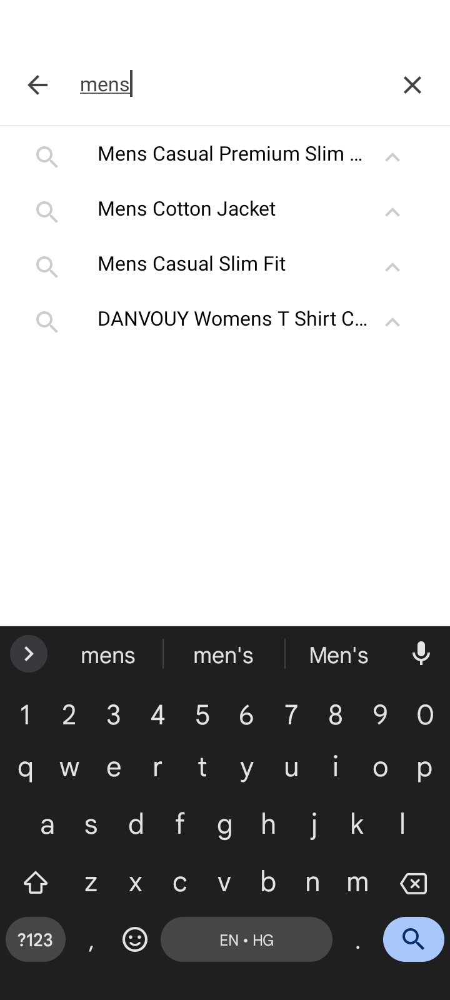
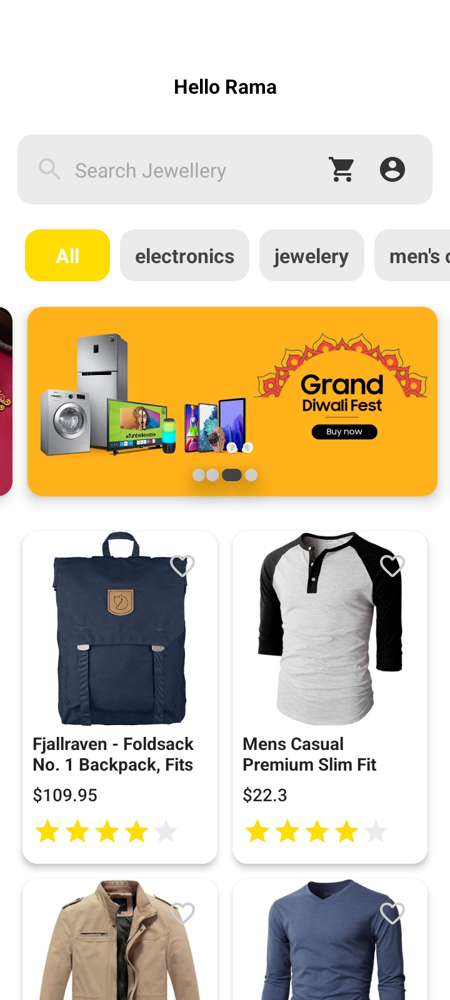
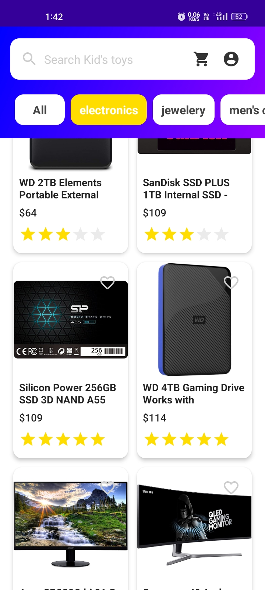
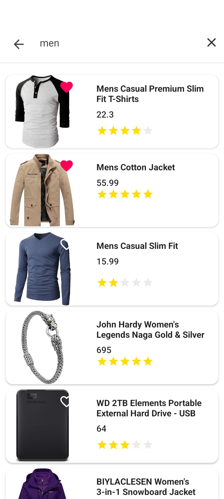
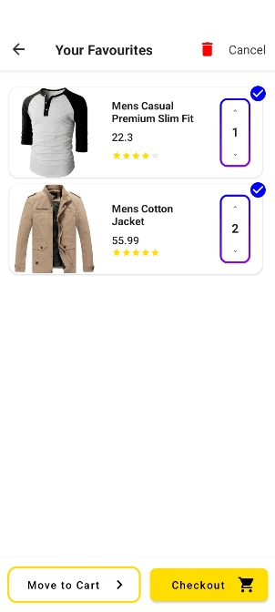
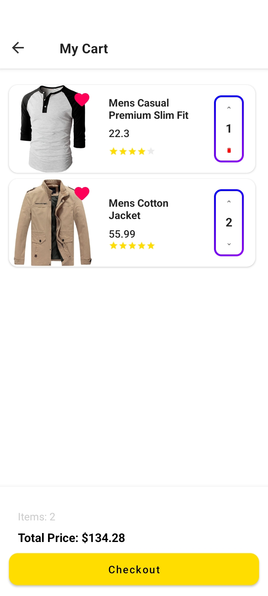
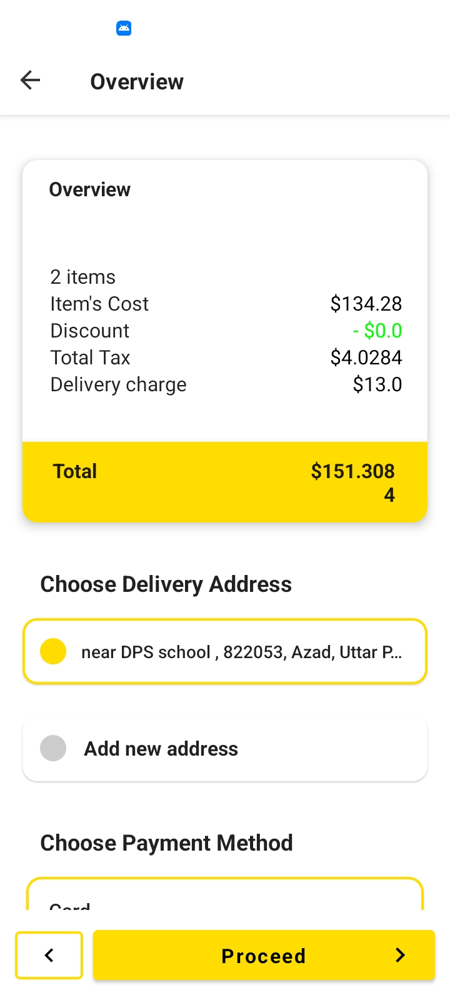
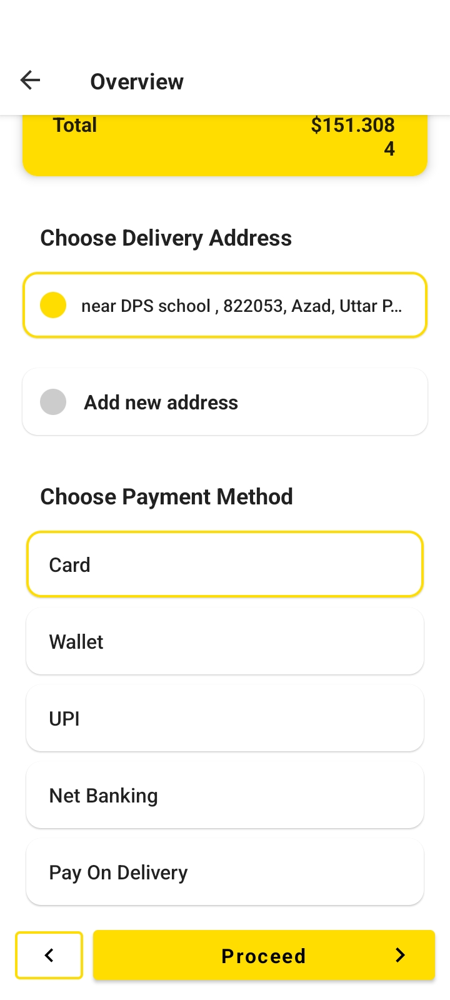

# Fake-Shopping
It's a basic Shop app that uses fakeStore API to fetch products, details and I have also tried to implement Clean Architecture

I know it's not good looking right now but as soon as i finish the basic structure and working of application , i will give it's UI a finished look

  
  
  
  
    
  
  
  
  

